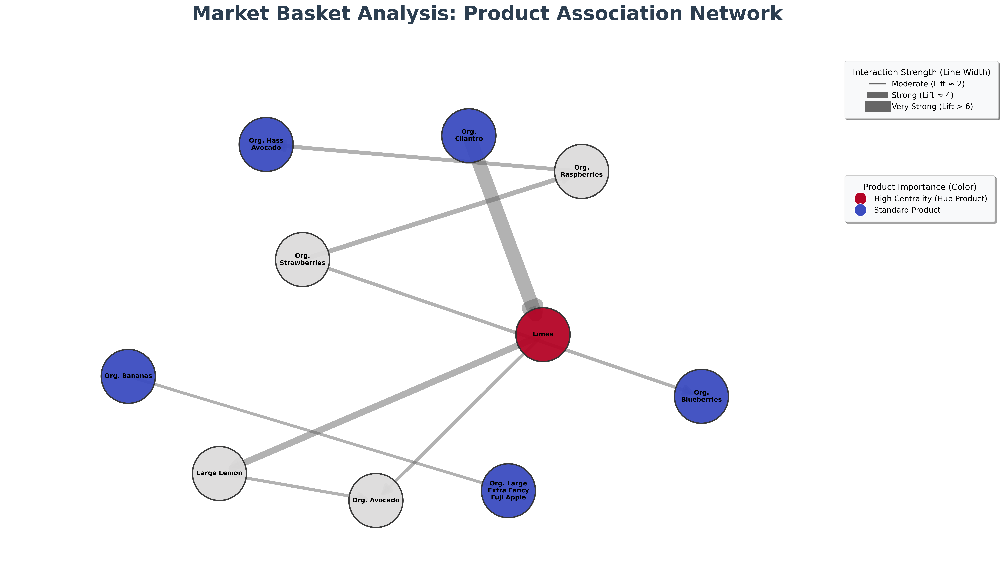

# 🛒 Instacart Market Basket Analysis & Recommendation Engine

## 📌 Project Overview
This project is a **Data Science & Analytics** solution developed to uncover hidden buying patterns in Instacart's grocery data. Using **Association Rule Mining (Apriori Algorithm)**, I analyzed over **1.3 million transactions** to understand product relationships.

The final output is an **Intelligent Recommendation Engine** (similar to "Customers who bought this also bought...") that suggests complementary products to increase **Cross-Selling** opportunities.

## 🚀 Key Features
* **Big Data Processing:** Efficiently handled and merged datasets with millions of rows.
* **Association Rule Mining:** Used `Apriori` and `Association Rules` to find strong product links.
* **Business Insights:** Identified high-lift product pairs (e.g., Limes & Organic Cilantro) for strategic store placement.
* **Interactive App:** A Python-based CLI tool where users input a product and get real-time recommendations.
* **Network Visualization:** Visualized complex product relationships using Graph Theory (NetworkX).

## 🛠️ Technologies Used
* **Language:** Python 3.10+
* **Libraries:** Pandas, Mlxtend, NetworkX, Matplotlib
* **Techniques:** Market Basket Analysis, Data Visualization, Lift & Confidence Metrics

## 📊 Key Findings (Sample Rules)
The analysis revealed specific high-value rules:

| Antecedent (If you buy...) | Consequent (...you also buy) | Lift Score | Insight |
| :--- | :--- | :--- | :--- |
| **Limes** | **Organic Cilantro** | **4.46** | Strong "Taco Night" correlation. |
| **Organic Raspberries** | **Organic Strawberries** | **2.60** | High affinity within berry category. |
| **Banana** | **Organic Fuji Apple** | **2.05** | Common healthy snack combination. |

## ⚠️ Project Constraints & Future Improvements
While this project successfully demonstrates the implementation of Market Basket Analysis for demonstration purposes, the following constraints apply:

1.  **Data Scope (Train vs. Prior):**
    * Due to local hardware memory constraints (RAM), this project utilizes the `order_products__train` subset.
    * *Scalability Note:* In a production environment (e.g., AWS/GCP), I would utilize the full `order_products__prior` dataset to generate more robust historical patterns.

2.  **Evaluation Metrics:**
    * The primary evaluation metrics used are **Lift** and **Confidence**.
    * *Next Step:* To further validate the recommendation engine, an offline evaluation technique (like **HitRate@K**) could be implemented.

---
*Developed by Fatma Betül Yıldırım *
